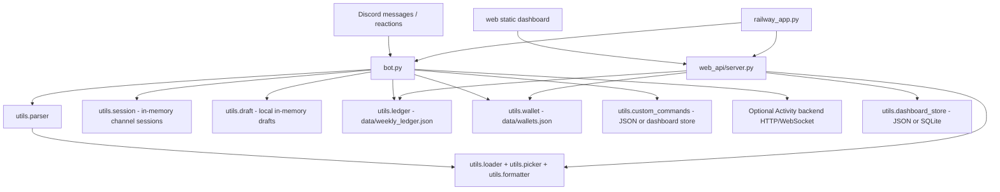

# GodForge

## Overview

GodForge is the core Smite 2 Discord operations bot for league play. It handles random god and build commands, temporary draft sessions, fearless draft workflows, match creation, betting, wallets, the live betting ledger, and early web dashboard/admin tooling.

It is built for Discord communities running Smite 2 draft nights or leagues where staff need one bot to coordinate picks, drafts, match IDs, betting windows, wallet balances, and weekly ledger operations.

ForgeLens, the companion stats bot, owns post-match screenshot/OCR ingestion and league reporting. GodForge still owns the live operational flow, including the active betting/ledger subsystem.

## Current Status

GodForge is active and production-ish for Discord league operations. The betting and wallet ledger is live, persisted in `data/`, and should be treated as depended-on operational state.

The project also contains a local/static web dashboard and Python web API bridge. That dashboard bridge is release-candidate/staging work: it exposes useful admin surfaces, temporary password auth, staged Discord OAuth, JSON-or-SQLite dashboard storage, and local API endpoints, but full guild permission enforcement and durable production dashboard storage are still evolving.

Important status notes:

- Randomizer, build, session, local draft, match, betting, wallet, and ledger commands are implemented in `bot.py` and `utils/`.
- Activity backend draft integration is optional and enabled only when `ACTIVITY_BACKEND_URL` is configured.
- Session and local draft state are in memory and reset on process restart.
- Ledger and wallet data persist as JSON files unless a dashboard storage setting is explicitly enabled for dashboard documents.
- Some server/report routing is still single-tenant by hard-coded IDs in `bot.py`.

## Core Features

### Random Gods And Builds

- `.rg` and `.rg{role}{source}` random god commands.
- `.roll5` and `.roll5{role}{source}` team-roll commands.
- Role codes: `j` jungle, `m` mid, `a` ADC, `s` support, `o` solo.
- Source codes: `w` website pool, `t` in-game tab pool.
- Build commands for chaos, mid, jungle, solo, ADC, and support item pools.
- Optional build item count from 1 to 5 on build commands.
- God aliases and role/build data are loaded from JSON in `data/`, with static fallback data in `utils/static_data/`.

### Draft Sessions

- Per-channel `.session start/show/reset/end`.
- Reaction-based pick locking for `.rg` and `.roll5` while a session is active.
- Picked gods and unresolved active rolls are excluded from later rolls in that channel.
- Sessions and drafts are mutually exclusive per channel.

### Fearless Drafts

- `.draft start @blue @red`, `.ban`, `.pick`, `.draft show`, `.draft next`, `.draft undo`, `.draft end`.
- Local fallback draft engine in `utils/draft.py`.
- Optional Activity backend mode through HTTP/WebSocket when `ACTIVITY_BACKEND_URL` is set.
- Draft exports are posted as JSON attachments at the end of a set.
- Completed game picks, not bans, populate the fearless pool.

### Match Betting And Ledger

- Admin match lifecycle commands: create, draft/lock betting, resolve winner, resolve prop.
- Player bet placement for match winners and over/under stat props.
- Wallet seeding, balance checks, admin give/take/set, and wallet wipe.
- Persistent paginated betting ledger embed in the configured ledger channel.
- Weekly ledger reset clears matches but leaves wallets intact.
- JSON persistence uses atomic writes in `utils/ledger.py` and `utils/wallet.py`.

### Web Dashboard And API Bridge

- Static dashboard under `web/`.
- Development/combined API bridge under `web_api/`.
- Combined Railway launcher in `railway_app.py` runs the Discord bot and web/API server in the same process container.
- Public API endpoints for randomizer/build tools.
- Protected admin endpoints for ledger, match, wallet, settings, custom commands, audit, and bot status.
- Temporary dashboard documents can use JSON or SQLite via `GODFORGE_STORAGE=sqlite`.

### Custom Commands

- Dashboard-configured custom dot commands are persisted by `utils/custom_commands.py`.
- Unknown dot commands can execute matching enabled custom command configs.
- Custom commands support channel gates, simple role gates, cooldowns, and mention suppression.

## Architecture / System Flow



Main data flow:

1. Discord users issue dot commands.
2. `bot.py` routes built-in betting commands directly and other commands through `utils.parser`.
3. Randomizer/build commands read JSON data and return embeds or text.
4. Sessions and local drafts are held in memory by channel ID.
5. Match betting writes to `data/weekly_ledger.json`; wallets write to `data/wallets.json`.
6. The live ledger embed stores its Discord message/channel pointer in the ledger JSON so the bot can edit or repost it.
7. The optional web API reuses the same Python modules for dashboard/admin actions.

## Commands / Usage

### Random God Commands

| Command | Result |
| --- | --- |
| `.rg` | Random god from the full roster |
| `.rgj`, `.rgm`, `.rga`, `.rgs`, `.rgo` | Random god by role |
| `.rgjw`, `.rgjt` | Random jungle god from website or tab source |
| `.roll5` | Five random gods |
| `.roll5j`, `.roll5m`, `.roll5a`, `.roll5s`, `.roll5o` | Five random gods by role |
| `.roll5jt` | Five jungle gods from the tab source |

Default source is `website`. Explicit sources are `w` for website and `t` for tab.

### Build Commands

| Command | Result |
| --- | --- |
| `.rc [1-5]` | Chaos build from the full item pool |
| `.midint [1-5]`, `.midstr [1-5]` | Mid intelligence/strength builds |
| `.jungint [1-5]`, `.jungstr [1-5]` | Jungle intelligence/strength builds |
| `.soloint [1-5]`, `.solostr [1-5]`, `.solohyb [1-5]` | Solo builds |
| `.adc [1-5]`, `.adcstr [1-5]`, `.adchyb [1-5]` | ADC builds |
| `.sup [1-5]` | Support build |

Without a count, build commands return 6 items. Counts outside 1-5 are ignored by the parser.

### Sessions

| Command | Result |
| --- | --- |
| `.session start` | Start a channel-scoped draft session |
| `.session show` | Show locked picks |
| `.session reset` | Clear picks while keeping the session active |
| `.session end` | End the session and post a summary |

### Fearless Drafts

| Command | Result |
| --- | --- |
| `.draft start @blue @red` | Start a draft set with blue/red captains |
| `.ban GodName` | Ban a god on the active captain's turn |
| `.pick GodName` | Pick a god on the active captain's turn |
| `.draft show` | Show draft history and fearless pool |
| `.draft next` | Lock the current game and advance |
| `.draft undo` | Undo the last draft action or game advance |
| `.draft end` | End the set and attach a JSON export |

### Match, Betting, Wallet, And Ledger

| Command | Who | Result |
| --- | --- | --- |
| `.match create @TeamA @TeamB` | Admin | Create `GF-0001` style match and open betting |
| `.match draft GF-XXXX` | Admin | Mark match in progress and lock betting |
| `.match resolve GF-XXXX winner @Team` | Admin | Resolve winner and pay win bets |
| `.match resolve GF-XXXX prop @player stat value` | Admin | Resolve over/under prop bets |
| `.bet GF-XXXX amount @Team win` | Player | Bet on match winner |
| `.bet GF-XXXX amount @player stat over|under threshold` | Player | Bet on a stat prop |
| `.wallet check [@player]` | Any/admin target | Check a wallet balance |
| `.wallet give @player amount` | Admin | Add points |
| `.wallet take @player amount` | Admin | Remove points |
| `.wallet set @player amount` | Admin | Set exact balance |
| `.wallet wipe` | Admin | Reset all wallets to 500 points after backup |
| `.ledger reset` | Admin | Clear weekly matches, preserve wallets |
| `.ledger post` | Admin | Repost the live ledger embed |

### Utility

| Command | Result |
| --- | --- |
| `.help` | Show bot command pages |

## Setup

### Prerequisites

- Python 3.11+ recommended.
- A Discord bot token.
- Discord Message Content Intent enabled.
- Server Members Intent enabled if using role/member-dependent behavior.
- Discord permissions: view/send messages, read history, add reactions, manage messages, embed links.
- Railway or another persistent host for always-on production use.

### Install

```powershell
pip install -r requirements.txt
```

For tests:

```powershell
pip install -r requirements-dev.txt
```

### Run The Discord Bot

```powershell
python bot.py
```

### Run The Web API Locally

```powershell
python web_api/server.py
```

Default local URL:

```text
http://localhost:8787
```

### Run Static Dashboard Preview

```powershell
cd web
npm install
npm run dev
```

Default local URL:

```text
http://localhost:5173
```

### Run Combined Railway Mode

```powershell
python railway_app.py
```

`Procfile` runs:

```text
web: python railway_app.py
```

### Database / Storage Setup

GodForge does not require a separate database for the Discord bot. Runtime state uses:

| File | Purpose |
| --- | --- |
| `data/weekly_ledger.json` | Active weekly match ledger and bets |
| `data/wallets.json` | Wallet balances |
| `data/gods.json` | God roster, pools, weights |
| `data/builds.json` | Item/build pools |
| `data/aliases.json` | God aliases |
| `data/custom_commands.json` | Dashboard custom command configs when JSON-backed |
| `data/guild_settings.json` | Temporary dashboard guild settings when JSON-backed |
| `data/admin_audit.json` | Dashboard/admin audit log |

Dashboard document storage can optionally use SQLite:

```text
GODFORGE_STORAGE=sqlite
GODFORGE_DB_PATH=/app/data/godforge_dashboard.db
```

## Environment Variables

| Variable | Required | Purpose |
| --- | --- | --- |
| `DISCORD_TOKEN` | Bot yes | Discord bot token. |
| `ACTIVITY_BACKEND_URL` | No | Enables Activity backend draft mode when set. Omit for local draft mode. |
| `ACTIVITY_API_KEY` | Activity backend only | API key sent as `X-Api-Key` to the Activity backend. |
| `BETTING_LEDGER_CHANNEL_ID` | Betting yes | Discord channel ID for the persistent betting ledger embed. `0` disables posting and triggers warnings. |
| `PLACE_BETS_CHANNEL_ID` | Recommended for betting | Restricts `.bet` commands to one channel. If `0`, bets are accepted from any channel. |
| `MATCH_DRAFT_CHANNEL_ID` | Optional / verify before production | Read by `bot.py`; purpose should be verified before production changes. |
| `HOST` | Web/API optional | Host binding for `web_api/server.py` or `railway_app.py`. Defaults differ between local API and Railway launcher. |
| `PORT` | Web/API optional | Web/API port. Defaults to `8787`. |
| `GODFORGE_ADMIN_PASSWORD` | Dashboard admin actions | Temporary password gate for protected dashboard actions. Do not use the placeholder value in production. |
| `GODFORGE_SESSION_SECRET` | Dashboard recommended | Session signing secret. Falls back through admin password or Discord token if unset. |
| `DISCORD_CLIENT_ID` | OAuth only | Discord OAuth client ID for dashboard login. |
| `DISCORD_CLIENT_SECRET` | OAuth only | Discord OAuth client secret. Never commit it. |
| `DISCORD_OAUTH_REDIRECT_URI` | OAuth optional | Dashboard OAuth callback URL. Defaults to the Railway URL in `web_api/server.py`. |
| `GODFORGE_STORAGE` | Dashboard optional | Set to `sqlite` to use SQLite for dashboard document storage. |
| `GODFORGE_DB_PATH` | Dashboard SQLite optional | SQLite DB path. Defaults to `data/godforge_dashboard.db`. |

## Operational Notes

- Unknown dot commands are ignored unless a dashboard custom command matches.
- `.match`, `.bet`, `.wallet`, and `.ledger` bypass `utils.parser` and are routed directly in `bot.py`.
- Admin checks use Discord administrator permissions in `bot.py`.
- Wallets are seeded to 500 points on first bet. Admin-created wallets start at 0 unless explicitly adjusted.
- Admin `.wallet take` can produce negative balances; this is documented in `utils/wallet.py`.
- `resolve_prop_bets` treats exact threshold ties as no winner.
- `.ledger reset` writes a backup to `data/weekly_ledger.bak.json` before clearing matches.
- `.wallet wipe` writes a backup to `data/wallets.bak.json` before resetting balances.
- The reports channel map and one privileged user ID in `bot.py` are hard-coded single-tenant constants.
- Session and draft cleanup runs every 5 minutes, but in-memory state is still lost on restart.
- Data JSON is cached by loaders; restart the bot after changing god/build/alias data.
- Dashboard auth is transitional: temporary password and staged OAuth exist, but full guild permission enforcement is future work.

## Known Issues / Refactor Targets

- Move hard-coded guild/report routing into per-guild configuration.
- Add or finish durable per-guild storage for settings, reports channels, and custom commands.
- Decide whether ledger/wallet state should remain JSON or move to a transactional store before multi-server production use.
- Review match ID generation and channel/server scoping before running one bot across unrelated leagues.
- Persist or recover draft/session state if live drafts must survive restarts.
- Audit Activity backend mode for retry, reconnect, and failure behavior around WebSocket draft state.
- Tighten dashboard authorization so admin actions require verified Discord guild permissions.
- Keep the betting/ledger subsystem active and stable; do not remove it as part of stats-bot separation work.

## Roadmap

- Stabilize the live dashboard bridge and OAuth permission checks.
- Move single-tenant constants into guild-scoped config.
- Add a safer durable backing store for operational data where JSON is too fragile.
- Improve draft and match recovery after restarts.
- Keep GodForge focused on live Discord operations while ForgeLens owns stats ingestion and reporting.

## Contributing / Development Notes

Read `docs/AI_WORKFLOW_GUARDRAILS.md` before AI-assisted implementation or production fixes.

Keep changes small and operationally safe:

- Do not change ledger or wallet behavior casually; existing data is live state.
- Do not edit schema/data files without understanding migration and backup impact.
- Add or update tests under `tests/` for command parsing, ledger, wallet, dashboard bridge, and concurrency behavior when touching those systems.
- Run the focused test suite before deploying:

```powershell
pytest
```

Useful local checks:

```powershell
python test_bot.py
python test_bot.py --sim
cd web
npm run test:security
npm run test:dashboard
```

When adding user-facing bot behavior, update `utils/formatter.py` help text and `VERSION_HISTORY.md` if the change warrants a visible version bump.
