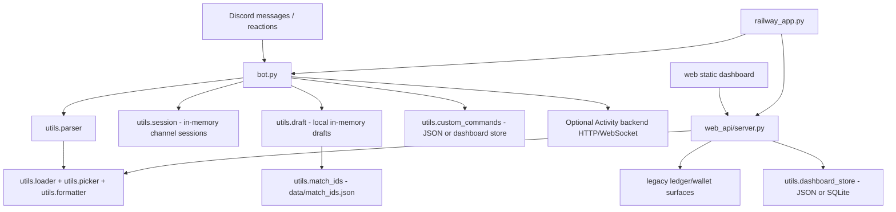

# GodForge

## Overview

GodForge is the Smite 2 Discord match orchestration bot. It handles random god and build commands, temporary draft sessions, fearless draft workflows, match ID generation, and draft JSON handoff.

It is built for Discord communities running Smite 2 draft nights or leagues where staff need one bot to coordinate picks, drafts, match IDs, and portable draft records.

GodForge is a standalone product. It does not require a companion bot for any
core workflow. An optional, disabled-by-default ForgeLens adapter preserves the
portable draft handoff for possible future statistics enrichment; economy and
betting are outside GodForge's scope.

## Current Status

GodForge is active and production-ish for Discord draft operations. Legacy
economy commands are deprecated and unavailable in the standalone product.

The project also contains a local/static web dashboard and Python web API bridge. That dashboard bridge is release-candidate/staging work: it exposes useful admin surfaces, temporary password auth, staged Discord OAuth, JSON-or-SQLite dashboard storage, and local API endpoints, but full guild permission enforcement and durable production dashboard storage are still evolving.

Important status notes:

- Randomizer, build, session, and local draft commands are implemented in `bot.py` and `utils/`.
- Activity backend draft integration is optional and enabled only when `ACTIVITY_BACKEND_URL` is configured.
- Legacy `.session` state is in memory. Local drafts persist orphan channel
  references for restart notices; the new party-lobby foundation persists full
  guild-scoped lifecycle records in SQLite.
- Legacy ledger and wallet modules still exist for migration/testing, but they are not part of the active Discord command surface.
- Owner and report routing are configured through environment variables, but
  per-guild self-service configuration is still planned.

## Core Features

### Random Gods And Builds

- `.rg` and `.rg{role}{source}` random god commands.
- `.roll5` and `.roll5{role}{source}` team-roll commands.
- Role codes: `j` jungle, `m` mid, `a` ADC, `s` support, `o` solo.
- Source codes: `w` website pool, `t` in-game tab pool.
- Build commands for chaos, mid, jungle, solo, ADC, and support item pools.
- Optional build item count from 1 to 5 on build commands.
- God aliases and role/build data are loaded from JSON in `data/`, with static fallback data in `utils/static_data/`.

### Draft Sessions

- Per-channel `.session start/show/reset/end`.
- Reaction-based pick locking for `.rg` and `.roll5` while a session is active.
- Picked gods and unresolved active rolls are excluded from later rolls in that channel.
- Sessions and drafts are mutually exclusive per channel.

### Fearless Drafts

- `.draft start @blue @red` still works standalone.
- Optional ForgeLens linkage, when explicitly enabled:
  `.draft start @blue @red --match FL-123 --game 2`.
- `.ban`, `.pick`, `.draft show`, `.draft next`, `.draft undo`, `.draft end`.
- Local fallback draft engine in `utils/draft.py`.
- Optional Activity backend mode through HTTP/WebSocket when `ACTIVITY_BACKEND_URL` is set.
- Draft embeds expose ForgeLens status only when the optional adapter is enabled.
- Draft exports are posted as portable JSON attachments at the end of a set.
- When claims finish, GodForge posts a visible `Draft complete` marker in-channel for observers.
- Completed game picks, not bans, populate the fearless pool.

### Web Dashboard And API Bridge

- Static dashboard under `web/`.
- Development/combined API bridge under `web_api/`.
- Combined Railway launcher in `railway_app.py` runs the Discord bot and web/API server in the same process container.
- Public API endpoints for randomizer/build tools.
- Protected admin endpoints still include legacy ledger/match/wallet surfaces during migration, but production mutations are guarded by `GODFORGE_ENABLE_LEGACY_ECONOMY=true`.
- Temporary dashboard documents can use JSON or SQLite via `GODFORGE_STORAGE=sqlite`.

### Custom Commands

- Dashboard-configured custom dot commands are persisted by `utils/custom_commands.py`.
- Unknown dot commands can execute matching enabled custom command configs.
- Custom commands support channel gates, simple role gates, cooldowns, and mention suppression.

### Zero-Config Guild Setup

- `/party setup` verifies permissions, creates the managed `#godforge-play`
  channel and temporary-room category, publishes a persistent Play panel, and
  stores the returned Discord IDs per guild.
- Setup creates permissionless Solo, Jungle, Mid, Support, and ADC cosmetic
  roles. Captain, Substitute, Region, and LFG roles are optional command flags.
- Re-running setup refreshes stored resources without duplication. Matching
  names are never silently adopted; conflicts produce a repair message.
- The Play panel supports Create Lobby, Browse Lobbies, Join Queue, and My
  Preferences. Preference buttons update both Discord roles and durable
  GodForge player preferences.
- Lobby creation captures mode, region, format, party size, voice requirement,
  skill band, and notes. Reusable lobby cards support join, leave, edit, cancel,
  and share actions without a web account.

## Architecture / System Flow



Main data flow:

1. Discord users issue dot commands.
2. `bot.py` routes deprecated economy commands to a deprecation response and other commands through `utils.parser`.
3. Randomizer/build commands read JSON data and return embeds or text.
4. Sessions and local drafts are held in memory by channel ID.
5. Draft start reserves a portable `match_id` from `data/match_ids.json`.
6. Draft end posts a portable JSON record; the optional adapter can map it for
   ForgeLens when enabled.
7. The optional web API reuses Python modules for dashboard/admin actions, including legacy migration surfaces.

## Commands / Usage

### Random God Commands

| Command | Result |
| --- | --- |
| `.rg` | Random god from the full roster |
| `.rgj`, `.rgm`, `.rga`, `.rgs`, `.rgo` | Random god by role |
| `.rgjw`, `.rgjt` | Random jungle god from website or tab source |
| `.roll5` | Five random gods |
| `.roll5j`, `.roll5m`, `.roll5a`, `.roll5s`, `.roll5o` | Five random gods by role |
| `.roll5jt` | Five jungle gods from the tab source |

Default source is `website`. Explicit sources are `w` for website and `t` for tab.

### Build Commands

| Command | Result |
| --- | --- |
| `.rc [1-5]` | Chaos build from the full item pool |
| `.midint [1-5]`, `.midstr [1-5]` | Mid intelligence/strength builds |
| `.jungint [1-5]`, `.jungstr [1-5]` | Jungle intelligence/strength builds |
| `.soloint [1-5]`, `.solostr [1-5]`, `.solohyb [1-5]` | Solo builds |
| `.adc [1-5]`, `.adcstr [1-5]`, `.adchyb [1-5]` | ADC builds |
| `.sup [1-5]` | Support build |

Without a count, build commands return 6 items. Counts outside 1-5 are ignored by the parser.

### Sessions

| Command | Result |
| --- | --- |
| `.session start` | Start a channel-scoped draft session |
| `.session show` | Show locked picks |
| `.session reset` | Clear picks while keeping the session active |
| `.session end` | End the session and post a summary |

### Fearless Drafts

| Command | Result |
| --- | --- |
| `.draft start @blue @red` | Start a draft set with blue/red captains |
| `.ban GodName` | Ban a god on the active captain's turn |
| `.pick GodName` | Pick a god on the active captain's turn |
| `.draft show` | Show draft history and fearless pool |
| `.draft next` | Lock the current game and advance |
| `.draft undo` | Undo the last draft action or game advance |
| `.draft end` | End the set and attach a JSON export |

### Utility

| Command | Result |
| --- | --- |
| `.help` | Show bot command pages |

## Setup

### Prerequisites

- Python 3.11+ recommended.
- A Discord bot token.
- Discord Message Content Intent enabled.
- Server Members Intent enabled if using role/member-dependent behavior.
- Discord permissions: view/send messages, read history, add reactions, manage messages, embed links.
- Railway or another persistent host for always-on production use.

### Install

```powershell
pip install -r requirements.txt
```

For tests:

```powershell
pip install -r requirements-dev.txt
```

### Run The Discord Bot

```powershell
python bot.py
```

### Run The Web API Locally

```powershell
python web_api/server.py
```

Default local URL:

```text
http://localhost:8787
```

### Run Static Dashboard Preview

```powershell
cd web
npm install
npm run dev
```

Default local URL:

```text
http://localhost:5173
```

### Run Combined Railway Mode

```powershell
python railway_app.py
```

`Procfile` runs:

```text
web: python railway_app.py
```

### Database / Storage Setup

GodForge does not require a separate database for the Discord bot. Runtime state uses:

| File | Purpose |
| --- | --- |
| `data/match_ids.json` | Orchestration match ID counter |
| `data/weekly_ledger.json` | Legacy/deprecated match ledger and bets |
| `data/wallets.json` | Legacy/deprecated wallet balances |
| `data/gods.json` | God roster, pools, weights |
| `data/builds.json` | Item/build pools |
| `data/aliases.json` | God aliases |
| `data/custom_commands.json` | Dashboard custom command configs when JSON-backed |
| `data/guild_settings.json` | Temporary dashboard guild settings when JSON-backed |
| `data/admin_audit.json` | Dashboard/admin audit log |

Dashboard document storage can optionally use SQLite:

```text
GODFORGE_STORAGE=sqlite
GODFORGE_DB_PATH=/app/data/godforge_dashboard.db
```

## Environment Variables

| Variable | Required | Purpose |
| --- | --- | --- |
| `DISCORD_TOKEN` | Bot yes | Discord bot token. |
| `ACTIVITY_BACKEND_URL` | No | Enables Activity backend draft mode when set. Omit for local draft mode. |
| `ACTIVITY_API_KEY` | Activity backend only | API key sent as `X-Api-Key` to the Activity backend. |
| `GODFORGE_PARTY_DB_PATH` | No | Standalone party-lifecycle SQLite path. Defaults to `data/godforge_party.db`. |
| `GODFORGE_ENABLE_FORGELENS` | No | Enables optional companion export/status compatibility. Disabled by default. |
| `BETTING_LEDGER_CHANNEL_ID` | Deprecated | Legacy betting ledger channel setting. |
| `PLACE_BETS_CHANNEL_ID` | Deprecated | Legacy bet placement channel setting. |
| `MATCH_DRAFT_CHANNEL_ID` | Deprecated | Legacy match draft setting. Draft orchestration uses `.draft` commands. |
| `GODFORGE_ENABLE_LEGACY_ECONOMY` | Legacy only | Enables legacy web/API economy mutations. Leave unset in normal production. |
| `HOST` | Web/API optional | Host binding for `web_api/server.py` or `railway_app.py`. Defaults differ between local API and Railway launcher. |
| `PORT` | Web/API optional | Web/API port. Defaults to `8787`. |
| `GODFORGE_ADMIN_PASSWORD` | Dashboard admin actions | Temporary password gate for protected dashboard actions. Do not use the placeholder value in production. |
| `GODFORGE_SESSION_SECRET` | Dashboard recommended | Session signing secret. Falls back through admin password or Discord token if unset. |
| `DISCORD_CLIENT_ID` | OAuth only | Discord OAuth client ID for dashboard login. |
| `DISCORD_CLIENT_SECRET` | OAuth only | Discord OAuth client secret. Never commit it. |
| `DISCORD_OAUTH_REDIRECT_URI` | OAuth optional | Dashboard OAuth callback URL. Defaults to the Railway URL in `web_api/server.py`. |
| `GODFORGE_STORAGE` | Dashboard optional | Set to `sqlite` to use SQLite for dashboard document storage. |
| `GODFORGE_DB_PATH` | Dashboard SQLite optional | SQLite DB path. Defaults to `data/godforge_dashboard.db`. |

## Operational Notes

- Unknown dot commands are ignored unless a dashboard custom command matches.
- Draft exports include stable identity, guild/channel context, game linkage,
  captains/teams, picks, bans, claims, timestamps, and draft order.
- Owner and reports routing use `GODFORGE_OWNER_USER_ID` and
  `GODFORGE_REPORTS_CHANNELS`.
- Session and draft cleanup runs every 5 minutes. In-memory session state is lost on restart; active local drafts notify their channel on restart via `data/active_local_drafts.json`.
- Data JSON is cached by loaders; restart the bot after changing god/build/alias data.
- Dashboard auth is transitional: temporary password and staged OAuth exist, but full guild permission enforcement is future work.
- Dashboard POST endpoints are CSRF-protected via a double-submit cookie (`godforge_csrf` + `X-CSRF-Token` header) set at login.

## Known Issues / Refactor Targets

- Move environment-based guild/report routing into self-service per-guild configuration.
- Add or finish durable per-guild storage for settings, reports channels, and custom commands.
- Remove remaining legacy ledger/wallet internals after compatibility windows close.
- Review match ID generation and channel/server scoping before running one bot across unrelated leagues.
- Persist or recover full session state across restarts (draft orphan notifications are implemented; full state recovery is not).
- Audit Activity backend mode for retry, reconnect, and failure behavior around WebSocket draft state.
- Tighten dashboard authorization so admin actions require verified Discord guild permissions.
- Keep GodForge focused on standalone party and match orchestration.

## Optional Compatibility Appendix

- `draft_id` is GodForge-owned and stable.
- `GODFORGE_ENABLE_FORGELENS=true` enables the optional adapter and external
  match linkage. It is disabled by default and cannot block a core workflow.
- Legacy web economy endpoints are default-off migration surfaces documented in
  [`docs/archive/LEGACY_WEB_DATA_CONTRACT.md`](docs/archive/LEGACY_WEB_DATA_CONTRACT.md).

## Roadmap

- See [`docs/STANDALONE_PRODUCT_PLAN.md`](docs/STANDALONE_PRODUCT_PLAN.md) for
  the standalone GodForge product direction and phased implementation plan.
- Stabilize the live dashboard bridge and OAuth permission checks.
- Follow the sequencing and linked implementation issues in
  [`docs/STANDALONE_PRODUCT_PLAN.md`](docs/STANDALONE_PRODUCT_PLAN.md).
- The `v2.3.0` release gate is zero-config guild setup, managed cosmetic roles,
  and live validation of durable party recovery.

## Contributing / Development Notes

Read `docs/AI_WORKFLOW_GUARDRAILS.md` before AI-assisted implementation or production fixes.

Keep changes small and operationally safe:

- Do not change legacy ledger or wallet internals casually; existing data may be migration state.
- Do not edit schema/data files without understanding migration and backup impact.
- Add or update tests under `tests/` for command parsing, draft handoff, dashboard bridge, and concurrency behavior when touching those systems.
- Run the focused test suite before deploying:

```powershell
pytest
```

Useful local checks:

```powershell
python test_bot.py
python test_bot.py --sim
cd web
npm run test:security
npm run test:dashboard
```

When adding user-facing bot behavior, update `utils/formatter.py` help text and `VERSION_HISTORY.md` if the change warrants a visible version bump.
